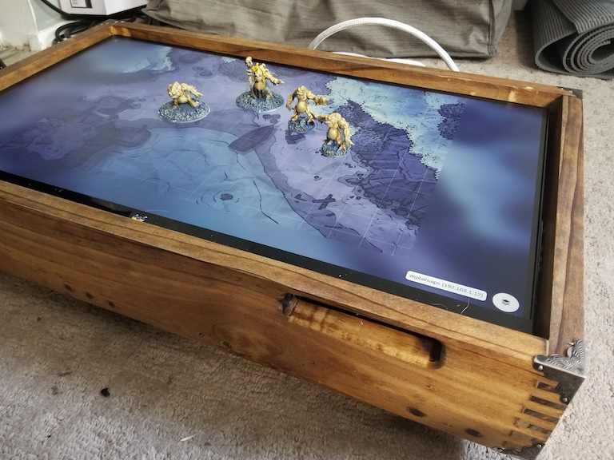
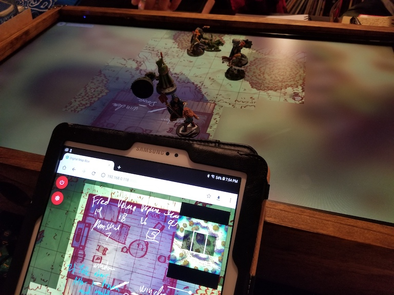

# Digital Map Box

This is a web server and client for a Digital Map Box. For presenting maps. (For Dungeons and Dragons.) If you have some type of digital map display such as a TV laying flat on a table, you may run the server on a Raspberry Pi and display the map through a local web browser.  

You may connect via web browser on another device to remotely control the map.

### Requirements

- NodeJS
- Chrome Web Browser (or Chromium)

### Building the Client

From the root of this repository, `npm install` and `npm run deploy`. This will build and deploy the client to the [`./server`](./server) directory.

### Building and Deploying the Server

In the `./server` directory, `npm install`. Copy the entire `./server` directory with built client to your display device, such as your Raspberry Pi or computer connected to your TV or monitor. In the `server` directory on your display device, run `npm start`.

- If you run as superuser, you will have access to the remote shutdown.
- If you install [`codazoda/hub-ctrl.c`](https://github.com/codazoda/hub-ctrl.c) you may remotely control USB powered devices such as fans.

### Map Files

Maps should be copied to the `./server/public/img` directory. This will be the default location when browsing for maps.

### Display Device

In a web browser on your display device, point your browser to `https://localhost:3000/?local=true`.

### Control Device

Browse to the IP address (port 3000) of the display device. From here, you may open the control interface by clicking the floating action button in the lower left.

- The "lock" mode allows drawing to the display device, controlling fog of war and controlling the viewport.
- The "unlock" mode allows drawing that will only appear on the control device. You may also pan the mini-map without moving the display device's viewport.
